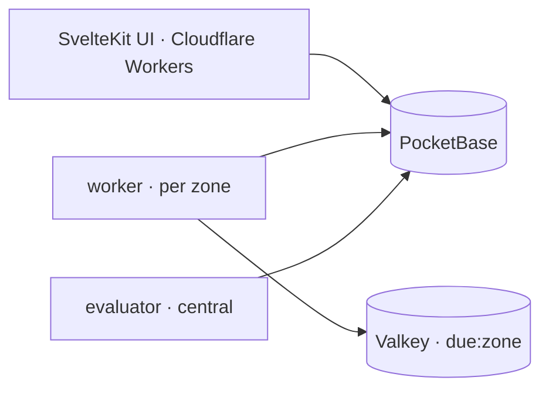

# nabz — multi-zone uptime monitoring

Region-aware uptime monitoring: define URLs, get up/down status **confirmed across
zones**, with incidents and email/webhook alerts. Go workers + a central
evaluator on top of PocketBase, with a SvelteKit UI.

Open source under the [AGPL-3.0](LICENSE), with a paid hosted version at
[nabz.sh](https://nabz.sh) — see [License & hosting](#license--hosting).

## What it does

- **Multi-zone HTTP checks** (httptrace DNS/connect/TLS/first-byte timings) written to PocketBase.
- **Cross-zone consensus** status — a single-zone blip doesn't flap; a real outage opens an **incident**.
- **Alerts** on incidents (email / webhook) + a **dead-man's switch** that fires when a zone stops sending heartbeats.
- **UI**: dashboard, per-monitor detail (response-time chart, per-zone results), incidents history, alert-channel management.
- **Hourly rollups + raw-check retention** keep PocketBase small while history is kept.

## Architecture



- **worker** (one per zone): pulls due monitors from a per-zone Valkey sorted set (`due:<zone>`), runs the check, writes a `checks` row, reschedules. Also publishes `zone_stats` (queue depth, schedule lag, heartbeat). Each zone has its **own local Valkey** — no central queue.
- **evaluator** (exactly one, central, independent of the zones): reads recent `checks`, runs N-of-M **consensus** → writes `monitors.status`, opens/resolves `incidents`, sends **alerts**, runs the **dead-man's switch**, builds **rollups**, and purges old `checks`.
- **PocketBase** holds everything (monitors, checks, rollups, incidents, alert_channels, zone_stats, users, scoped service accounts). The worker/evaluator authenticate as **least-privilege service accounts**, not superusers.

See [`docs/architecture-decisions.md`](docs/architecture-decisions.md) for why the system is shaped the way it is.

## Tech stack

| Layer | Tech |
|---|---|
| UI | SvelteKit (Cloudflare Workers) |
| Backend | Go — `worker`, `evaluator`, shared `corelib` |
| Data / auth | PocketBase (v0.23+) |
| Queue | Valkey (one per zone) |

## Running locally

Local VMs, per-role compose, node hardening: [`deploy/README.md`](deploy/README.md).
For a real install see **Running it yourself** below. The PocketBase schema
([`infrastructure/pb_schema.json`](infrastructure/pb_schema.json)) is imported by
the bootstrap; tightening a constraint in it is a data migration
([`docs/schema-constraints.md`](docs/schema-constraints.md)).

### Repo layout

- `worker/` — per-zone checker (Valkey sorted-set scheduling → writes `checks`)
- `evaluator/` — central consensus/status, incidents, alerts, rollups + retention
- `corelib/` — shared Go (PocketBase client, Valkey cache, models)
- `app/` — SvelteKit UI
- `deploy/` — per-role compose + setup/orchestration scripts
- `infrastructure/pb_schema.json` — PocketBase collections
- `benchmarks/pbbench/` — load-test tool behind the capacity numbers
- `docs/` — [architecture decisions](docs/architecture-decisions.md), the
  [design system](docs/design-system.md), [scaling](docs/scaling.md),
  [schema constraints](docs/schema-constraints.md), and the measured
  [capacity](docs/pocketbase-capacity.md) / [storage](docs/pocketbase-storage.md) ceilings

## Running it yourself

Four roles, each a compose file in [`deploy/`](deploy/). They can share a host or
sit on separate ones; the only hard requirement is that the workers and the
evaluator can reach PocketBase.

| Role | Compose file | What it is |
|---|---|---|
| **pocketbase** | [`deploy/pocketbase.yml`](deploy/pocketbase.yml) | The datastore, and the only stateful piece. Holds monitors, checks, incidents, rollups. |
| **worker** | [`deploy/worker.yml`](deploy/worker.yml) | One per zone — runs the checks for that zone. Ships a Valkey sidecar for scheduling; several workers in a zone share one Valkey. |
| **evaluator** | [`deploy/central.yml`](deploy/central.yml) | Exactly one. Consensus and status, incidents, alerting, rollups, retention. |
| **web** | [`deploy/web.yml`](deploy/web.yml) | The SvelteKit UI and API. |

Each role reads an env file. Copy the matching `*.env.example`, fill it in, and
point compose at it:

```bash
cp deploy/worker.env.example /etc/monitors/worker.env
$EDITOR /etc/monitors/worker.env
docker compose --env-file /etc/monitors/worker.env -f deploy/worker.yml \
  --profile local-cache up -d
```

The compose files are the source of truth for what runs. The
[`deploy/setup-*.sh`](deploy/) scripts only bootstrap a bare host — Docker, the
code, the env file — and then hand off to compose.

### What each role needs

Every role authenticates to PocketBase with a **scoped service account**, not a
superuser: `PB_URL`, `PB_AUTH_COLLECTION` (`service_accounts`), `PB_ADMIN_USERNAME`,
`PB_ADMIN_PASSWORD`. The PocketBase bootstrap creates those accounts.

- **pocketbase** ([`pocketbase.env.example`](deploy/pocketbase.env.example)) — the
  superuser to seed with, the pinned `PB_VERSION`, where `pb_data` lives
  (`PB_DATA_DEVICE` / `PB_DATA_MOUNT`), optional SMTP for verification and reset
  mail, and optional S3-compatible backups (`PB_BACKUP_S3_*`, `PB_BACKUP_CRON`).
  `PB_LOGS_MIN_LEVEL` matters more than it looks: at the default, PocketBase writes
  a row per API request and the log database outgrows the real data.
- **worker** ([`worker.env.example`](deploy/worker.env.example)) — `REGION_NAME` is
  the zone this worker checks for, and it is the shard key written to every check
  row, so treat it as immutable. `WORKER_REPLICAS` runs several workers on one host;
  they share the host's Valkey and elect one seeder between them.
- **evaluator** ([`evaluator.env.example`](deploy/evaluator.env.example)) — SMTP for
  alert email, an optional `OPS_WEBHOOK_URL`, `DEADMAN_SECONDS` (how long a zone may
  be silent before it is treated as dead) and `CERT_EXPIRY_WARN_DAYS`.
- **web** ([`web.env.example`](deploy/web.env.example)) — `ORIGIN` must match the URL
  you serve from, `PKCE_FLOW_ENCRYPTION_KEY` is a random secret, and `ADMIN_EMAILS`
  is the allowlist that gates the admin usage page.

`HEALTH_DEBUG_TOKEN` is shared by every role. Without it the health endpoints
return a minimal public body; with it they return scrubbed per-item detail. See
**Health endpoints** in [`deploy/README.md`](deploy/README.md).

### A minimum install

One host running all four roles, one zone, no TLS termination of its own:

1. Bring up **pocketbase** first — it imports
   [`infrastructure/pb_schema.json`](infrastructure/pb_schema.json) and seeds the
   service accounts every other role logs in with.
2. Bring up **evaluator** and one **worker**, both pointed at that PocketBase.
3. Bring up **web**, and put a TLS terminator in front of it.

Two zones is where the design starts paying off — a single zone cannot form
consensus, so every blip looks like an outage. Zones are just workers with
different `REGION_NAME` values.

### Scaling and hardening

- Several workers per zone, on one host or across several sharing a Valkey:
  [`docs/scaling.md`](docs/scaling.md).
- Node hardening (firewall, key-only SSH, unattended upgrades) is in
  [`deploy/harden.sh`](deploy/harden.sh), applied by the setup scripts.
- Backups, WAL checkpointing and bounded vacuuming:
  [`deploy/pocketbase/README.md`](deploy/pocketbase/README.md).
- Measured limits before you plan capacity:
  [capacity](docs/pocketbase-capacity.md) and [storage](docs/pocketbase-storage.md).

### Deploying to cloud hosts

[`deploy/`](deploy/) also carries the scripts behind the hosted deployment —
provisioning, a private network, a tunnel so the datastore has no public port, and
per-role setup over SSH. They are opinionated about one particular stack and are
included because they are the real thing rather than an illustration; nothing in
the product requires them. `deploy/README.md` describes what they do.

## Testing & coverage

- **App** (SvelteKit): `vitest` unit tests — `cd app && npm test` (or `npm run test:unit` for units only).
- **Go** (`corelib` / `worker` / `evaluator`): `go test ./...` in each module.

**CI** ([`.github/workflows/ci.yml`](.github/workflows/ci.yml)) runs both suites with coverage on every PR and push — a failing test fails the build, and the per-suite coverage lands in the run's job summary. On merge to `main`, CI recomputes coverage and refreshes the **shields.io badges** at the top of this README (the repo is private, so shields can't read a live data source — the numbers are baked into static badges, updated in place). Regenerate them locally with `./scripts/coverage.sh --write`, or just print the numbers with `./scripts/coverage.sh`.

Coverage is reported per module by that workflow; the app figure is unit-test coverage of `src/`, and is honest-over-aspirational — most server/route + SSR paths are exercised by integration and manual dev verification rather than vitest units, so the headline is deliberately low rather than inflated.

## License & hosting

**Open source under the [GNU AGPL-3.0](LICENSE).** Run it yourself, read it, change
it, deploy it for your own use — the whole system is here, including the
provisioning that stands a fleet up from nothing.

AGPL rather than MIT for one specific reason: this is software people run *as a
service*. Under AGPL section 13, anyone who offers a modified version to users over
a network has to offer those users its source. That keeps improvements to a hosted
fork available to the people using it, which a permissive licence does not.

Practically, for the common cases:

- **Self-hosting for yourself or your company** — no obligation beyond keeping the
  licence and notices. You are a user, not a distributor.
- **Modifying it and offering it to others as a service** — your modifications have
  to be offered to those users under the AGPL too.
- **Vendoring parts of it into a proprietary product** — AGPL is copyleft, so this
  is the case it deliberately does not allow.

**Hosted at [nabz.sh](https://nabz.sh)** for people who would rather not run it: the
same software, operated for you, on a paid plan. Running it yourself costs nothing
and is missing nothing — the hosted offering sells the operating, not the features.
